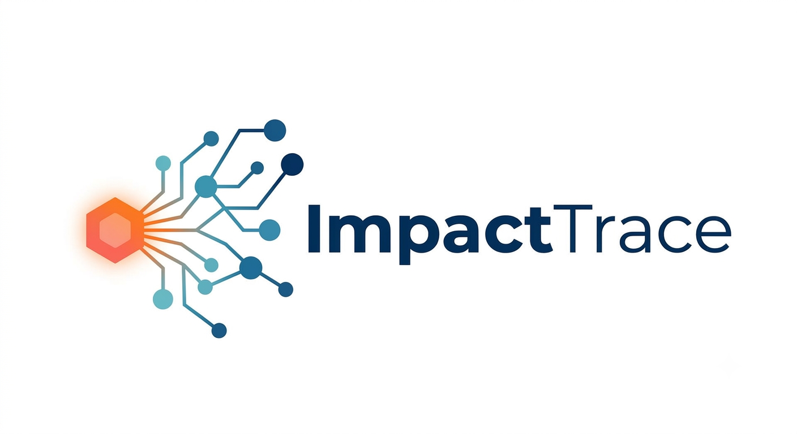
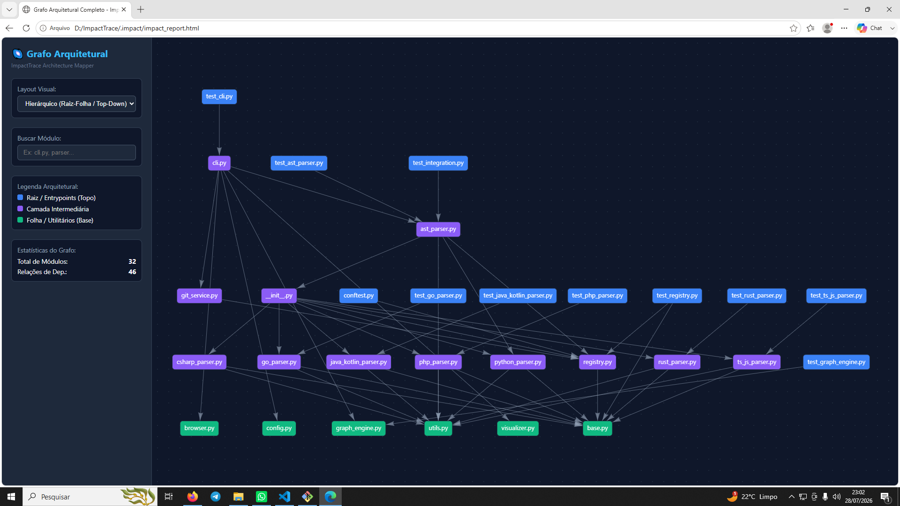
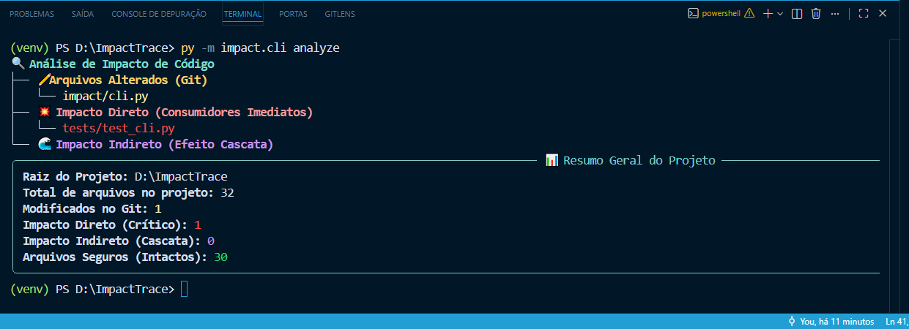
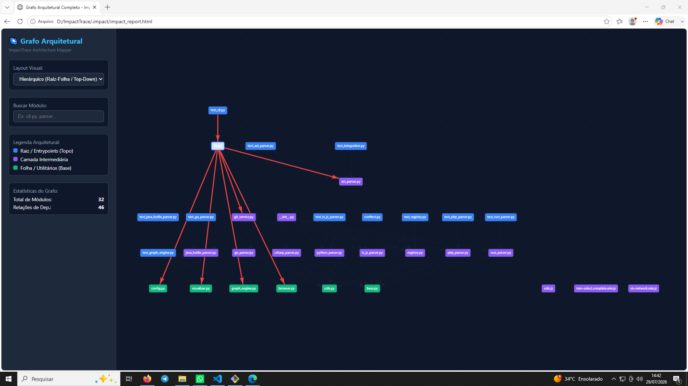

<div align="center">
  
  <h1>ImpactTrace</h1>
  <h3>O mapeador de raio de impacto e dependências para Python.</h3>
  <p>Saiba exatamente o que vai quebrar antes de fazer o push.<br/><b>Zero configurações. Análise via AST. Grafos interativos.</b> 100% Local.</p>

  <p>
    <a href="#quickstart">Quickstart</a> ·
    <a href="#features">Recursos</a> ·
    <a href="#vs-others">vs Git Diff</a> ·
    <a href="#ai-integration">Agentes de IA</a> ·
    <a href="#architecture">Arquitetura</a> ·
    <a href="#faq">FAQ</a>
  </p>

  <!-- Badges -->
  <p>
    
    
    
  </p>

  <!-- Screenshot/GIF Principal -->
  
</div>

> **Revisar código visualmente cego é um risco desnecessário.** O `git diff` mostra as linhas que você alterou, mas não mostra quem depende delas. O ImpactTrace analisa a AST do seu código, calcula o efeito cascata e gera grafos interativos de impacto em milissegundos.

---

## 📸 Veja em Ação

<table>
  <tr>
    <td align="center" width="50%">
      
      <br/><b>Terminal Rich Tree</b><br/>
      <sub>Visualização imediata no terminal dos impactos diretos, indiretos e arquivos seguros.</sub>
    </td>
    <td align="center" width="50%">
      
      <br/><b>Grafo Interativo (Vis.js)</b><br/>
      <sub>Navegação hierárquica por camadas. Clique em qualquer módulo para destacar suas conexões em vermelho.</sub>
    </td>
  </tr>
</table>

---

## ⚖️ ImpactTrace vs Abordagens Tradicionais

| Recursos | Git Diff Padrão | Code Review Manual | **ImpactTrace** |
|---|:---:|:---:|:---:|
| **Visão de Mudança Direta** | ✅ | ✅ | ✅ |
| **Mapeamento de Efeito Cascata** | ❌ | 🧠 Lento / Falho | ✅ **Instantâneo (AST)** |
| **Relatório Otimizado para LLMs / Agentes** | ❌ | ❌ | ✅ **JSON Estruturado** |
| **Visualização de Grafo Interativo** | ❌ | ❌ | ✅ **HTML / Vis.js** |
| **Detecção de Type-Checking vs Runtime** | ❌ | ❌ | ✅ |

---

## 🏗️ Arquitetura

```

┌────────────────────────────────────────────────────────────────────┐
│  ImpactTrace CLI / Core Engine                                     │
├────────────────────────────────────────────────────────────────────┤
│  1. Git Diff Detector   ➔  Identifica arquivos alterados           │
│  2. AST Dependency Parser➔ Mapeia imports (Runtime & Type-Check)   │
│  3. NetworkX Graph      ➔ Calculador de impacto (Predecessors)     │
├──────────────────────────┬─────────────────────────────────────────┤
│  Renderers               │  Exportadores                           │
│  • Rich Terminal Tree    │  • Relatório HTML (Vis.js Interativo)    │
│  • Force & Top-Down Graph│  • Relatório AI JSON (LLM Context)       │
└──────────────────────────┴─────────────────────────────────────────┘

```

---

## 🤖 Uso com Agentes de IA (Cursor, Claude Code, Windsurf)

Passe o contexto de impacto direto para o seu agente antes de pedir refatorações:

```bash
impact analyze --format ai-json > .impact-context.json

```

---

## 🚀 Guia de Instalação e Execução

### 1. Copie o Módulo e Instale as Dependências

No seu projeto pessoal, adicione as dependências do ImpactTrace ao seu ambiente virtual (`venv`):

```bash
pip install typer rich networkx pyvis gitpython

```

*(Ou adicione as linhas acima ao seu `requirements_impact.txt` dentro da pasta `impact/` e rode `pip install -r impact/requirements.txt`).*

### 2. Inicialize o ImpactTrace no Seu Projeto

Dentro da pasta do seu projeto pessoal, execute:

```bash
python impact/cli.py init
```
ou
```bash
py -m impact.cli init
```

> *Isso criará o diretório local `.impact/` com as regras de exclusão padrão (`venv`, `.git`, etc).*

### 3. Mapeie as Dependências (Scan)

Para construir o primeiro grafo de dependências do projeto:

```bash
python impact/cli.py scan
```
ou
```bash
py -m impact.cli scan
```

Você verá um diagnóstico imediato dos arquivos analisados e a quantidade de relações encontradas.

---

## 🎮 Comandos do Dia a Dia

### 🔍 Analisar Impactos de Alterações do Git (`analyze`)

Altere um ou mais arquivos no seu código e rode:

```bash
python impact/cli.py analyze
```
ou
```bash
py -m impact.cli analyze
```

O terminal exibirá uma árvore colorida dividida em:

* ✏️ **Arquivos Alterados:** O que você modificou no Git.
* 💥 **Impacto Direto:** Quem importa seus arquivos diretamente.
* 🌊 **Impacto Indireto:** Efeito cascata em outras camadas da aplicação.

#### 🌐 Abrindo o Relatório Interativo no Navegador:

```bash
python impact/cli.py analyze --web
```
ou
```bash
py -m impact.cli analyze --web
```

#### 🤖 Exportando para Agentes de IA (Cursor, Copilot, ChatGPT):

```bash
python impact/cli.py analyze --format ai-json
```
ou
```bash
py -m impact.cli analyze --format ai-json
```

> *Gera uma estrutura JSON limpa projetada para servir de contexto exato para LLMs entenderem o impacto do seu refactoring.*

---

### 🌌 Visualizar o Grafo Arquitetural Completo (`graph`)

Para ver a estrutura completa de todas as conexões do seu projeto em uma interface HTML5 no seu navegador padrão:

```bash
python impact/cli.py graph
```
ou
```bash
py -m impact.cli graph
```

* **Legenda Visual:**
* 🔵 **Azul (Raiz):** Entrypoints / Views (Top da hierarquia).
* 🟣 **Roxo (Intermediário):** Serviços, Validadores e Regras de Negócio.
* 🟢 **Verde (Folha):** Módulos utilitários e conexões de Banco de Dados.

---

## 🗺️ Roadmap de Evolução Futura

Atualmente, o ImpactTrace funciona com mapeamento na granularidade de **arquivos** (`File-Level Dependencies`). A visão de futuro do projeto inclui:

```text
[ Versão Atual 1.0 ] ➔ Mapeamento de Dependências entre Arquivos (.py)
        │
        ▼
[ Versão 2.0 ] ➔ Análise Fina de Símbolos Internos
                          ├── Rastreamento de Funções Chamas
                          ├── Inspecção de Importação de Variáveis e Classes
                          └── Identificação do Escopo Exato da Quebra

```

---

## ⚖️ Trade-offs de Engenharia: Design e Performance

Ao projetar o ImpactTrace, tomamos decisões conscientes sobre onde investir tempo e recursos:

| Aspecto | Decisão de Design | Trade-off Assumido |
| --- | --- | --- |
| **Instalação das Bibliotecas** | Uso de dependências como `pyvis`, `networkx`, `rich` e `gitpython`. | **A Instalação Inicial Não é Veloz:** O download e compilação dessas bibliotecas no `pip install` leva alguns segundos a mais. |
| **Visualização no Navegador** | Geração de HTML5 interativo via VisNetwork. | **A Recompensa:** Gráficos ricos, arrastáveis, com zoom e alternância de layout (Hierárquico vs Força-Dirigida) que eliminam qualquer dúvida sobre a arquitetura. |
| **Execução do Scan e Análise** | Parser AST com cache incremental via SHA-256 e poda no nível do S.O. | **Velocidade Ultra-Rápida ($O(N)$):** O escaneamento e o cálculo de impacto rodam em **poucos milissegundos**, mesmo em projetos com centenas de arquivos. |

---

## 📄 Licença

Este projeto é distribuído sob a licença **MIT**. Sinta-se livre para adaptar e utilizar no seu fluxo de trabalho diário.


